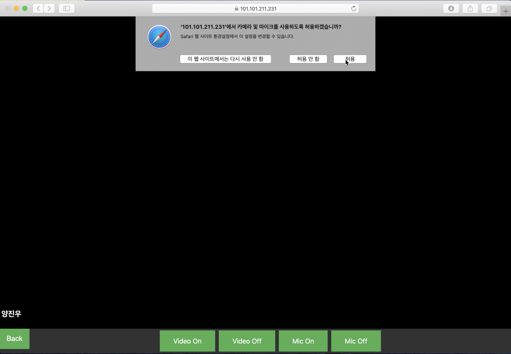
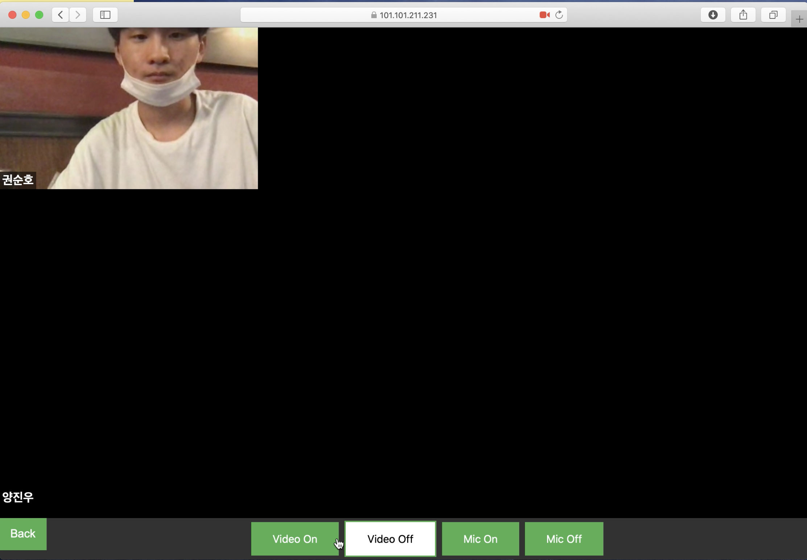
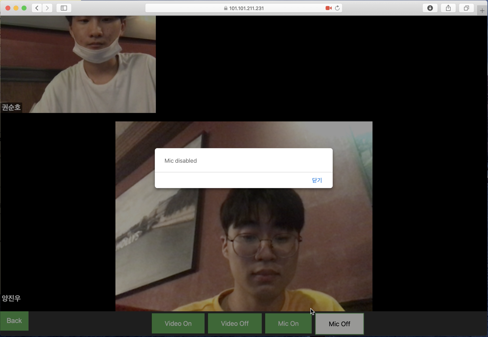

# Video Conference
WQVC(WebRTC-QUIC Video Conference)의 Video Conference 마이크로서비스.

## 사전 설치 요구사항
위 프로그램을 사용하기 전에 `https://github.com/SKrns/WQVC-AUTH`를 설치해야한다.

## 설치 방법
깃 레포를 다운로드한다 

`git clone https://github.com/SKrns/webRTC.git`.

레포지토리를 다운로드 한후, src/main/java/com/pororo/webrtc/WebrtcApplication.java를 실행시킨다.

```
cd webRTC

./mvnw package && java -jar target/webrtc-0.0.1-SNAPSHOT.jar
```

## 실행방법
### 마이크 및 카메로 허용
`https://github.com/SKrns/WQVC-AUTH`에서 만든 회의에서 회의 참가를 누른다. 회의 참가를 누르고 다음과 같은 화면에서 카메라 및 마이크를 허용한다.


### 카메라 조절
카메라를 끄고 싶은 상황이 있을 경우 아래의 버튼들 중 Video off를 누르면 된다. 반면, 카메라를 다시 키고 싶을 경우, Video On을 누르면 된다.


### 마이크 조절
마이크 조절 역시 키고 싶으면 audio on, 끄고 싶은 경우 audion off를 누르면 된다.
